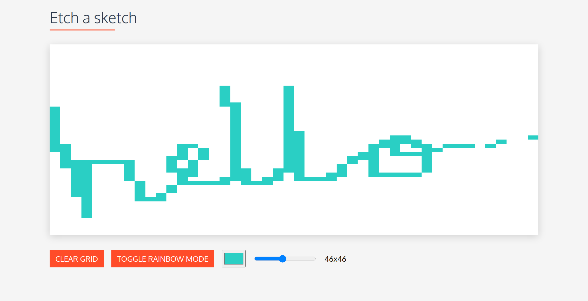

# etch-a-sketch

A simple JavaScript sketching app created as part of
[The Odin Project's Foundations Course](https://www.theodinproject.com/paths/foundations/courses/foundations/lessons/etch-a-sketch-project).

## how to view the website locally

1. Download Node and Npm.
2. Run `npm install` to install dependencies.
3. Run `npm start` to start the live server.
   You can then view the website at [localhost:1234](http://localhost:1234).

You can also just view the [live website here](https://asadmoosvi-etch-a-sketch.netlify.app/).

## screenshot

